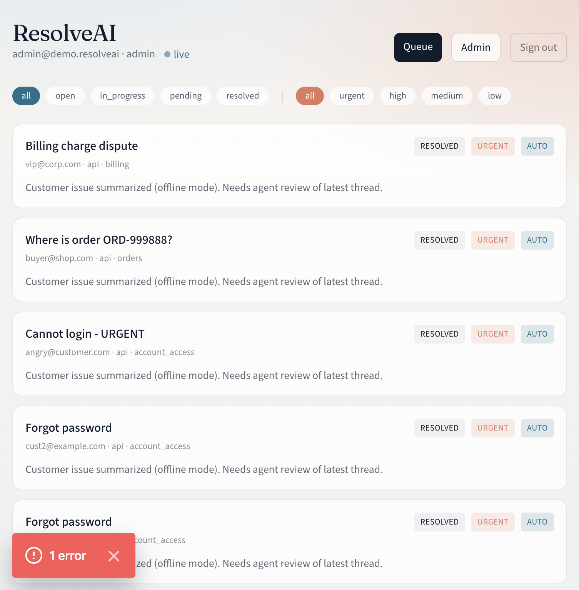
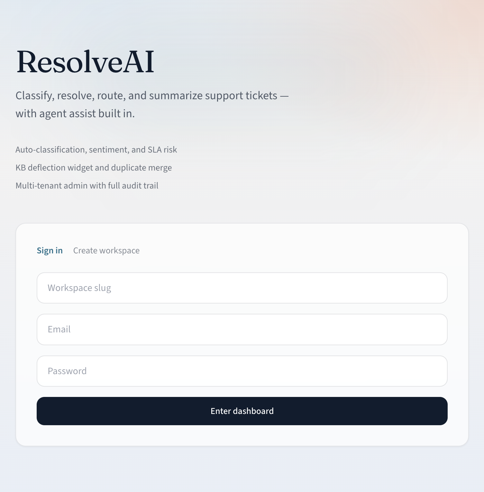
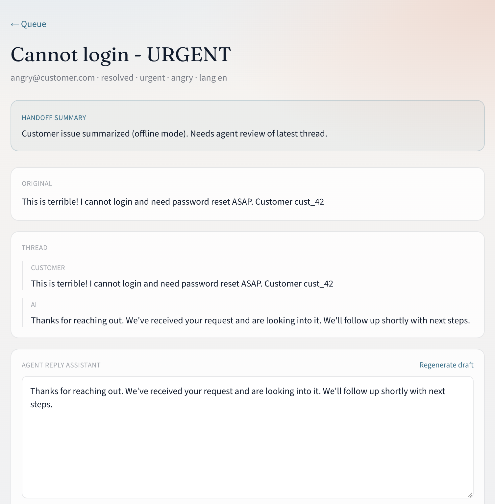
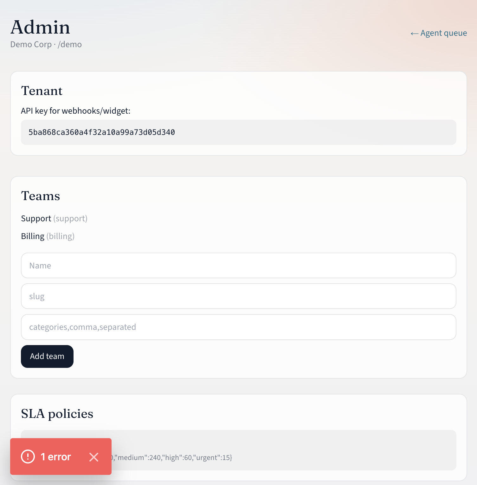
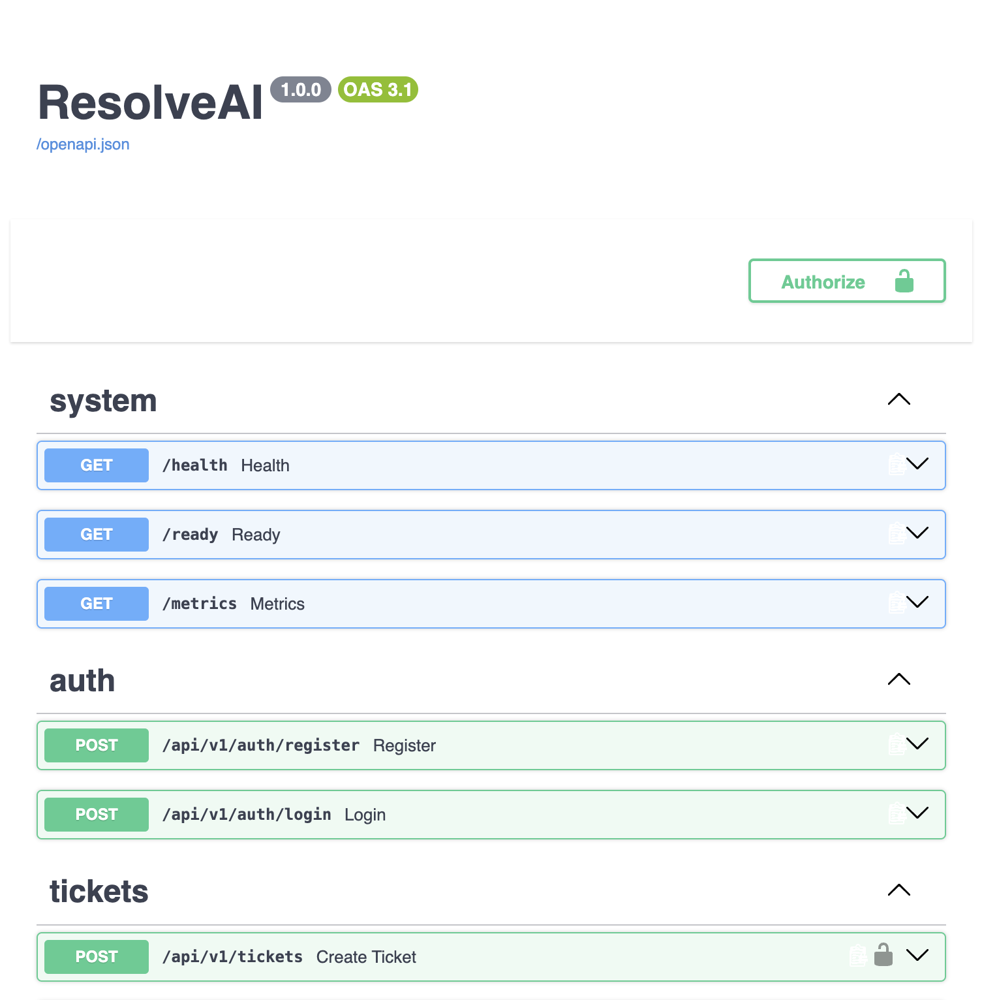

# ResolveAI

### Ticket automation & support resolution platform

<p align="center">
  
</p>

<p align="center">
  Ingest → classify → resolve → route → translate → summarize<br/>
  Multi-tenant support automation with agent assist and admin controls.
</p>

<p align="center">
  
  
  
  
  
  
</p>

---

## Overview

ResolveAI is a multi-tenant helpdesk automation platform. Tickets arrive from API, email, embeddable widget, or helpdesk webhooks (Zendesk / Freshdesk / Intercom). Each ticket runs through a processing pipeline that:

1. Detects language and translates when needed  
2. Classifies category, priority, and owning team  
3. Scores sentiment and escalates high-risk conversations  
4. Matches similar resolved tickets and knowledge-base articles  
5. Attempts auto-resolution with controlled tool calls  
6. Drafts first responses and agent replies  
7. Estimates SLA breach risk  
8. Summarizes threads for handoffs  
9. Predicts CSAT and can trigger a proactive follow-up  
10. Drafts KB articles when the same unresolved issue keeps recurring  

The stack includes JWT auth with RBAC, per-tenant data isolation, audit events, WebSocket live updates, rate limiting, Docker Compose, and GitHub Actions CI.

---

## Screenshots

### Sign in


### Agent queue


### Ticket detail


### Admin


### API docs


---

## Architecture

```text
 Email / Widget /     ┌──────────────────────────┐
 Zendesk / API  ─────►│ FastAPI · JWT · RBAC     │
                      └────────────┬─────────────┘
                                   │
                      ┌────────────▼─────────────┐
                      │ Ticket processing pipeline│
                      │ classify → resolve → SLA │
                      └──────┬──────────┬────────┘
                             │          │
                ┌────────────▼──┐  ┌────▼────────────┐
                │ PostgreSQL    │  │ Redis + Celery  │
                └───────────────┘  └─────────────────┘
                             │
                ┌────────────▼───────────────────┐
                │ Next.js dashboard + widget     │
                │ WebSocket status updates       │
                └────────────────────────────────┘
```

| Layer | Choice |
|---|---|
| API | Python, FastAPI, SQLModel |
| Models | Anthropic Claude API |
| Similarity | Local embeddings (swap-ready for managed embedding APIs) + cosine search |
| Data / jobs | PostgreSQL, Redis, Celery |
| UI | Next.js 14, Tailwind |
| Ops | Docker Compose, GitHub Actions, Prometheus `/metrics`, optional Sentry |

---

## Features

| # | Feature | Description |
|---:|---|---|
| 1 | Classification | Category, priority, team routing on arrival |
| 2 | First response | Contextual reply from ticket + KB + similar cases |
| 3 | Auto-resolution | Tools for password reset, order status, subscription |
| 4 | Sentiment | Escalates angry / urgent conversations |
| 5 | Similar tickets | Vector match against resolved history |
| 6 | KB updater | Drafts articles from recurring open issues |
| 7 | Reply assistant | Editable draft in the agent ticket view |
| 8 | SLA predictor | Risk score; Celery beat scan every 15 minutes |
| 9 | Translation | Detect and translate inbound / outbound |
| 10 | Summarizer | Short handoff summary |
| 11 | Deflection widget | Answers before a ticket is filed |
| 12 | Escalation router | Rules and complexity-based routing |
| 13 | CSAT prediction | Low score can trigger a save follow-up |
| 14 | Duplicate merge | Same customer + similar embedding within 48h |
| 15 | Admin dashboard | Teams, SLA, routing, KB, settings |
| 16 | Audit trail | Timestamped AI and agent actions per ticket |

---

## Ticket pipeline

```text
translate → classify → sentiment → embed → dedup
        → similar/KB → auto_resolve
        → first_response → sla_risk → summarize
        → csat (if resolved) → kb_draft_check
```

Auto-resolver tools:

- `reset_password(customer_id)`
- `get_order_status(order_id)`
- `check_subscription_status(customer_id)`

If confidence is low, the ticket stays with a human agent.

---

## Quick start

### Local (SQLite)

```bash
git clone https://github.com/abstractednick/ResolveAI.git
cd ResolveAI

python3 -m venv .venv && source .venv/bin/activate
pip install -r requirements.txt
cp .env.example .env

python scripts/seed.py
uvicorn app.main:app --reload --port 8000

# separate terminal
cd frontend && npm install && npm run dev
```

| Field | Value |
|---|---|
| Workspace slug | `demo` |
| Email | `admin@demo.resolveai` |
| Password | `demo12345` |

- API docs: http://localhost:8000/docs  
- Dashboard: http://localhost:3000  
- Widget: open `widget/index.html`

### Docker

```bash
cp .env.example .env
# set JWT_SECRET; set ANTHROPIC_API_KEY for live model calls
docker compose up --build
docker compose exec api python scripts/seed.py
```

Without `ANTHROPIC_API_KEY`, the API uses rule-based responses so local development still works.

---

## API

| Endpoint | Purpose |
|---|---|
| `POST /api/v1/auth/register` | Create tenant + admin |
| `POST /api/v1/auth/login` | JWT login |
| `POST /api/v1/tickets` | Create ticket (runs pipeline) |
| `POST /api/v1/public/tickets` | Public create with `X-Tenant-Key` |
| `POST /api/v1/webhooks/email/inbound` | Inbound email |
| `POST /api/v1/webhooks/zendesk` | Helpdesk ingest |
| `POST /api/v1/widget/query` | Deflection widget |
| `WS /ws/{tenant_id}` | Live dashboard events |
| `GET /health` · `/ready` · `/metrics` | Health and metrics |

---

## Repository layout

```text
app/           API, auth, models, services, workers
frontend/      Agent + admin UI
widget/        Embeddable deflection widget
tests/         API and isolation tests
docs/          Spec, screenshots, verification notes
scripts/       Seed helpers
```

---

## Design notes

- Multi-tenant: every row is scoped by `tenant_id`; isolation is covered by tests  
- Processing is a service chain with tool side effects and confidence gating  
- Public routes are rate-limited; ticket bodies are sanitized  
- Non-production runs the pipeline inline if Celery is unavailable  
- Production (`APP_ENV=production`) expects Celery worker + beat  

---

## Tests & CI

```bash
pytest -q
```

`.github/workflows/ci.yml` runs tests on push and builds the API image on `main`.

---

## Production

- Use a strong `JWT_SECRET`, managed Postgres, Redis, and `ANTHROPIC_API_KEY`  
- Run API, Celery worker, and beat as separate services  
- Point embeddings at a managed provider when you need higher recall  
- Scrape `/metrics`, set `SENTRY_DSN`, monitor `/health` and `/ready`  
- Rollback via previous image tag; restore DB if a migration was applied  

---

## Author

**Nirmal Tailor** — full-stack engineer focused on applied AI systems and multi-tenant SaaS.

Repository: [github.com/abstractednick/ResolveAI](https://github.com/abstractednick/ResolveAI)
